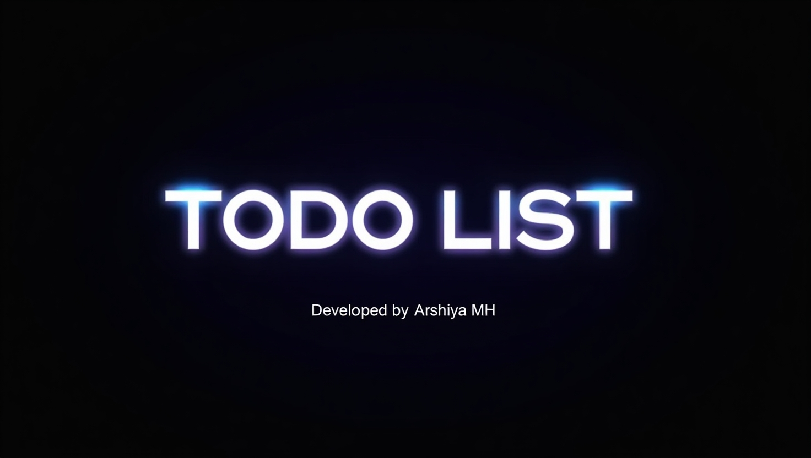

# To-Do List
A simple and interactive To-Do List application built with HTML, CSS, and JavaScript. Manage your tasks efficiently with features like adding, marking as done, and deleting tasks.

🚀 **Live Demo**  
[View Project](https://arshiya-mh.github.io/TODOLIST/)

## 📌 Features
- ✅ Add, remove, and toggle tasks
- ✅ Mark tasks as completed with a strike-through effect
- ✅ Clean and simple design
- ✅ Responsive design for mobile and desktop devices

## 🛠️ Technologies Used
- HTML
- CSS
- JavaScript

## 📥 Installation & Usage
No installation required. Simply open the `index.html` file in your browser to start using the To-Do List app.

## 📸

## 📜 License
This project is open-source and free to use.

🚀 **Developed by Arshiya MH**
